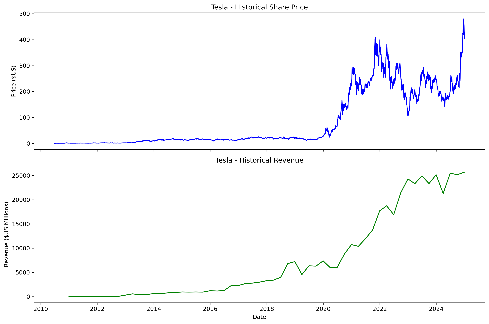

# Tesla Stock & Revenue Analysis

This project uses local CSV data to clean and visualize Tesla's (TSLA) stock price and revenue data.

This project was originally based on an exercise case in the IBM Data Analyst course, with the following modifications:

- No longer scrape data online (to avoid yfinance rate limiting and network issues)
- Read Tesla's stock price and revenue data directly from a local `csv` file
- Clean the revenue data (remove `$` and commas and convert to numerical values)
- Extract data within a specified time range and create comparative charts

---

## Project Structure

```text
.
├─ data/
│  ├─ tesla_stock.csv        # Tesla stock price (daily) data
│  └─ tesla_revenue.csv      # Tesla's quarterly revenue data
├─ notebook/
│  └─ Extracting and Visualizing Stock Data of Tesla.ipynb   # Analysis code written in Jupyter
├─ images/
│  └─ data_of_tesla.png      # The generated chart
├─ requirements.txt
└─ README.md

## Data Source & Disclaimer

- The stock price and revenue data were originally obtained from public financial websites
  (e.g. Yahoo Finance) and then saved as local CSV files.
- This project is for learning and educational purposes only.
- This project is not affiliated with, endorsed, or sponsored by Tesla, Inc.

## Technologies Used

- Python  
- Pandas   
- Matplotlib  
- Jupyter Notebook  
```
## Visualization Example




